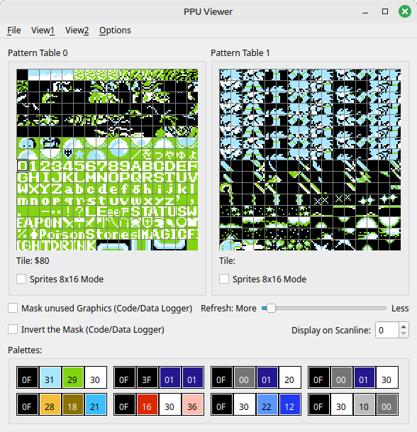
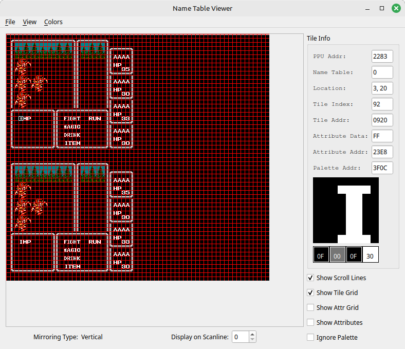
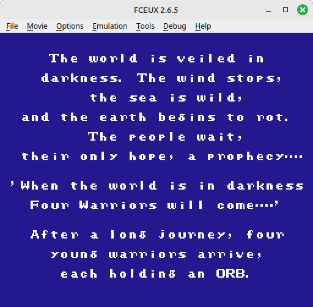

# final fantasy monster list

GOAL: Extract the list of monsters in the game and their stats, sprites would be bonus

Looking at the ines header learned the following

* prg rom
* no chr rom
* uses chr ram
* mapper 1 = mmc1

## Reference links

[6502 Guide - ASL Reference](https://www.nesdev.org/obelisk-6502-guide/reference.html#ASL)

[Final Fantasy ROM Map](https://datacrystal.tcrf.net/wiki/Final_Fantasy/ROM_map)

[Final Fantasy RAM Map](https://datacrystal.tcrf.net/wiki/Final_Fantasy/RAM_map)

<https://nescartdb.com/profile/view/715/final-fantasy>

[Writing a Disassembler and Memory Viewer](https://medium.com/hard-mode/nes-emulator-writing-a-disassembler-and-memory-viewer-4727e76de57)

Using ghidra to get the disassembly didn't give good results, figured out more with FCEUX debugging tools

### 12/30

Using FCEUX

PPU view to find that character tiles start at $80

Wandered around till a battle with an IMP, verified with name table viewer that IMP was 92 96 99 in the name table viewer

Wrote python code to read in nes rom, and build strings while the read byte was between 80 and C5, print out all strings > 2 characters

Looks like it works, IMP has a P in front of it

PIMP, GrIMP, WOLF,GrWOLF,WrWOLF,FrWOLF,IGUANA,AGAMA,SAURIA,GIANT,FrGIANT,R.GIANT,SAHAG,R.SAHAG,WzSAHAG

Looking for the intro text it's mostly found but broken up into substrings

Monster names in rom between 0x2d5ef and 0x2d951

checked against [Game Corner Monster Guide](https://guides.gamercorner.net/ff/monsters/)

looks good except for some spaces

started using [ImHex](https://github.com/WerWolv/ImHex/)

can write a custom pattern for a monster class and apply it to memory at addresses or in a loop

    enum element : u8 {
      None,    // 0x0000
      Fire = 0x10,
      Cold = 0x20,
      Lightning=0x40,
      Earth=0x80,
      Earth_Fire = 0x90
    };

    enum family : u8 {
      None,
      Dragon = 0x02,
      Giant = 0x04,
      Aquatic = 0x20,
      Aquatic_Dragon = 0x22,
      Spellcast = 0x40
    };

    struct MonsterStats {
        u16 exp;
        u16 gold;
        u16 HP;
        u8 morale;
        u8 unknown1; //ai?
        u8 unknown2; //evade?
        u8 absorb;
        u8 hits;
        u8 unknown5; //hit rate?
        u8 dmg;
        u8 unknown6; //crit rate?
        u8 unknown7; //?
        u8 unknown8; //attack ailment?
        family group;
        u8 unknown10; //magic def?
        element weak;
        element resist;
    
    };

    /*MonsterStats IMP @ 0x305A8-(0x14*6);
    MonsterStats GrIMP @ 0x305A8-(0x14*5);
    MonsterStats IGUANA @ 0x305A8;
    MonsterStats AGAMA @ 0x305BC;
    MonsterStats SAURIA @ 0x305D0;
    MonsterStats GIANT @ 0x305E4;
    MonsterStats FrGIANT @ 0x305F8;
    MonsterStats R_GIANT @ 0x3060C;
    MonsterStats SAHAG @ 0x30620;*/
    
    MonsterStats Monster[128] @ 0x30530;
    //unknown
    //Names
    //sprites
    //monster id?
    //hit%
    //status
    //crit
    //evade
    //magic defence
    //run level
    //magic
    //special attack
    //family
    //enumbate weak/resist bitvector

    //NAME    HP  GOLD EXP  DMG HIT HIT% Status  Crit ABS EVD MDEF RUNLVL MAG SPATT   FAM    WEAK    RESIS
    //IGUANA  92  50   153  18  1   95   -       5%   12  12  28   27     -   -       Dragon -       -
    //AGAMA   296 1200 2472 31  2   120  -       1%   18  18  72   -      -   25%     Dragon Cold    Fire
    //SAURIA  196 658  1977 30  1   110  -       1%   20  12  46   -      -   50%     Dragon -       -
    //GIANT   240 879  879  38  1   113  -       1%   12  24  60   28     -   -       Giant  -       -
    //FrGIANT 336 1752 1752 60  1   122  -       1%   16  24  75   -      -   -       Giant  Fire    Cold
    //R.GIANT 300 1506 1506 73  1   125  -       1%   20  24  68   -      -   -       Giant  Cold    Fire
    //SAHAG   28  30   30   10  1   87   -       1%   4   36  14   15     -   -       Aqua   Lightg  Fire, Earth

    // weak and resist bitvector
    // 01 = ?
    // 02 = ?
    // 04 = ?
    // 08 = ?
    // 16 = fire
    // 32 = cold
    // 64 = lightning
    // 128 = earth

## TODO

* bitvector for family

* bitvector for weak

* bitvector for resist

## New Ideas:

* find intro text

* get monster sprites

* Get music
